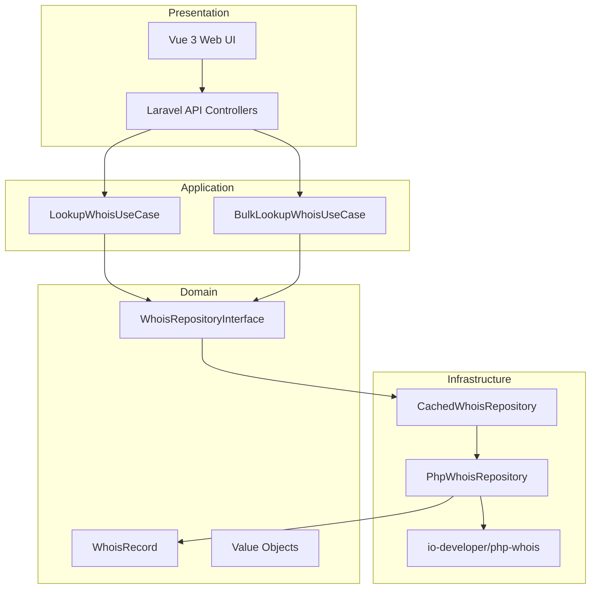
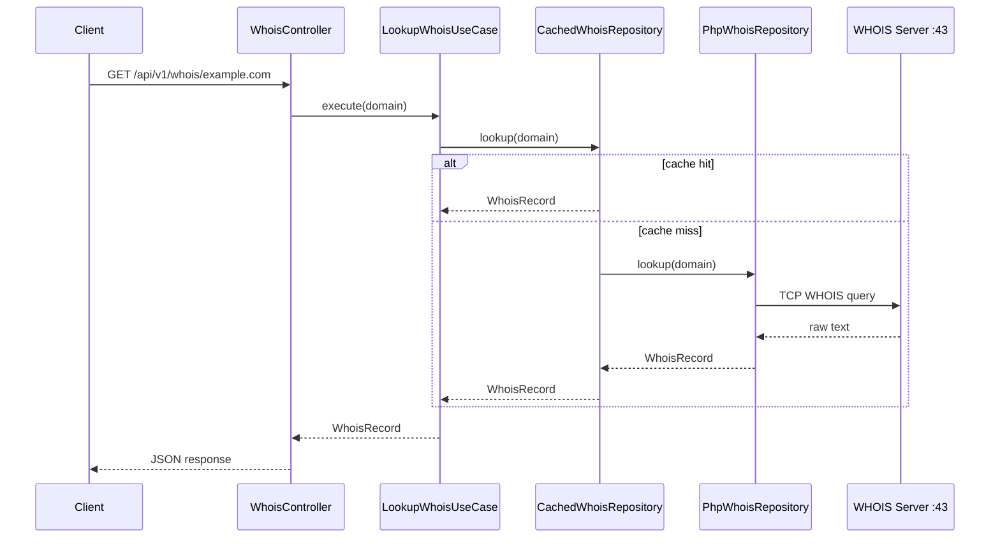

<p align="center">
  
</p>

<p align="center">
  <a href="LICENSE"></a>
  
  
  
  
  
</p>

<p align="center">
  <strong>WhoisScope</strong> is an open-source WHOIS lookup platform built with Laravel and Vue.js.<br>
  Use it as a <strong>REST API</strong>, a <strong>full-stack web app</strong>, or both — with caching, rate limiting, bulk queries, and a multilingual UI.
</p>

<p align="center">
  <a href="#-quick-start">Quick Start</a> ·
  <a href="#-features">Features</a> ·
  <a href="#-api-reference">API</a> ·
  <a href="#-configuration">Configuration</a> ·
  <a href="#-architecture">Architecture</a> ·
  <a href="LICENSE">License</a>
</p>

---

## Overview

WhoisScope lets you look up domain registration data through a clean web interface or a versioned JSON API. It parses raw WHOIS responses, detects whether a domain is **registered**, **available**, or **unknown**, and returns structured fields such as registrar, creation date, expiry date, and status codes.

The project follows **Domain-Driven Design (DDD)** so business rules stay independent from Laravel, the WHOIS library, and the Vue frontend.

<p align="center">
  
</p>

| Mode | Best for |
|------|----------|
| **Web UI** | Manual lookups, bulk CSV export, exploring results |
| **REST API** | Integrations, scripts, backend services |
| **API + UI** | Self-hosted product with built-in documentation at `/docs` |

---

## ✨ Features

| Feature | Description |
|---------|-------------|
| 🔍 **Single lookup** | Query one domain with `summary` or `full` response format |
| 📦 **Bulk lookup** | Up to 50 domains per request, parallel processing, per-domain status |
| ⚡ **Smart cache** | Results cached by default (1 hour); repeat queries are near-instant |
| 🛡️ **Rate limiting** | Per-IP limits on single and bulk endpoints |
| 🌍 **Multilingual UI** | 7 languages in the web interface |
| 📄 **CSV export** | Download bulk results from the web UI |
| 🎯 **Registration status** | `registered`, `available`, `unknown`, or `error` per domain |
| 📚 **Built-in API docs** | Interactive reference at `/docs` |
| 🔓 **MIT licensed** | Free for personal and commercial use |

---

## 🚀 Quick Start

### Requirements

| Tool | Version |
|------|---------|
| PHP | 8.3 or higher |
| Composer | 2.x |
| Node.js | 20+ (for frontend build) |
| SQLite | Included (default) or MySQL/PostgreSQL |

### Installation

```bash
git clone https://github.com/your-org/whois-api.git
cd whois-api

composer install
cp .env.example .env
php artisan key:generate
php artisan migrate

npm install
npm run build
```

### Run locally

**Option A — Full stack (recommended for first run)**

```bash
# Terminal 1
php artisan serve

# Terminal 2
npm run dev
```

Open **[http://localhost:8000](http://localhost:8000)**

| Page | URL |
|------|-----|
| Home (lookup UI) | `/` |
| API documentation | `/docs` |

**Option B — API only**

```bash
php artisan serve
```

The API works without building the frontend. Endpoints are available under `/api/v1/whois/*`.

**Option C — One command (dev)**

```bash
composer dev
```

Runs the PHP server, queue worker, logs, and Vite dev server together.

---

## 🖥️ Web Interface

The UI includes two tabs:

1. **Domain Whois** — single domain lookup with summary/full format
2. **Bulk Whois** — paste up to 50 domains (one per line or comma-separated), view accordion results, export CSV

Supported interface languages:

| Code | Language |
|------|----------|
| `en` | English *(default)* |
| `tr` | Türkçe |
| `es` | Español |
| `fr` | Français |
| `pt` | Português |
| `zh` | 中文 |
| `ar` | العربية |

---

## 📡 API Reference

Base URL: `http://localhost:8000/api/v1/whois`

### Endpoints

| Method | Endpoint | Rate limit | Description |
|--------|----------|------------|-------------|
| `GET` | `/whois/{domain}` | 60/min per IP | Single domain lookup |
| `POST` | `/whois/bulk` | 10/min per IP | Bulk domain lookup |

### Query / body parameters

| Parameter | Location | Values | Default |
|-----------|----------|--------|---------|
| `format` | query or JSON body | `summary`, `full` | `summary` |
| `domains` | JSON body (bulk only) | array of strings, max 50 | — |

### Response formats

**`summary`** — essential fields:

`domain`, `registration_status`, `registrar`, `created_at`, `expires_at`, `states`

**`full`** — all parsed fields plus raw WHOIS text:

`whois_server`, `owner`, `updated_at`, `name_servers`, `dnssec`, `raw`, …

### Single lookup example

```bash
curl -s "http://localhost:8000/api/v1/whois/google.com?format=summary" | jq
```

```json
{
  "data": {
    "domain": "google.com",
    "registration_status": "registered",
    "registrar": "MarkMonitor Inc.",
    "created_at": "1997-09-15T04:00:00+00:00",
    "expires_at": "2028-09-14T04:00:00+00:00",
    "states": ["client delete prohibited", "client transfer prohibited"]
  }
}
```

### Bulk lookup example

```bash
curl -s -X POST "http://localhost:8000/api/v1/whois/bulk" \
  -H "Content-Type: application/json" \
  -d '{
    "domains": ["google.com", "this-domain-is-free-xyz123.com"],
    "format": "summary"
  }' | jq
```

```json
{
  "format": "summary",
  "results": [
    {
      "domain": "google.com",
      "status": "registered",
      "data": { "domain": "google.com", "registration_status": "registered", "...": "..." }
    },
    {
      "domain": "this-domain-is-free-xyz123.com",
      "status": "available",
      "data": { "domain": "this-domain-is-free-xyz123.com", "registration_status": "available", "...": "..." }
    }
  ]
}
```

### Bulk result statuses

| Status | Meaning |
|--------|---------|
| `registered` | Domain has active WHOIS registration data |
| `available` | Domain appears unregistered / available |
| `unknown` | WHOIS response could not be classified confidently |
| `error` | Lookup failed (invalid domain, timeout, server error) |

### Error responses

Errors return JSON with `message` and `code`:

| HTTP | Code | Typical cause |
|------|------|----------------|
| `422` | `invalid_domain` | Malformed domain name |
| `429` | `too_many_requests` | Rate limit exceeded |
| `502` | `lookup_failed` | WHOIS server unreachable or TLD unsupported |
| `500` | `server_error` | Unexpected server error |

---

## ⚙️ Configuration

All WHOIS-related settings live in `.env` and `config/whois.php`.

```env
# Timeouts (seconds)
WHOIS_TIMEOUT=8
WHOIS_CONNECT_TIMEOUT=3

# Bulk
WHOIS_BULK_LIMIT=50
WHOIS_BULK_CONCURRENCY=5
WHOIS_BULK_MAX_EXECUTION=300

# Cache
WHOIS_CACHE_ENABLED=true
WHOIS_CACHE_TTL=3600

# Rate limits (requests per minute, per IP)
WHOIS_RATE_LIMIT=60
WHOIS_BULK_RATE_LIMIT=10

# Laravel cache driver — use redis in production for best performance
CACHE_STORE=database
```

| Variable | Default | Description |
|----------|---------|-------------|
| `WHOIS_TIMEOUT` | `8` | Max seconds to read WHOIS server response |
| `WHOIS_CONNECT_TIMEOUT` | `3` | Max seconds to open TCP connection (port 43) |
| `WHOIS_BULK_CONCURRENCY` | `5` | Parallel lookups during bulk requests |
| `WHOIS_BULK_LIMIT` | `50` | Max domains per bulk request |
| `WHOIS_CACHE_TTL` | `3600` | Cache lifetime in seconds (1 hour) |
| `WHOIS_RATE_LIMIT` | `60` | Single lookup requests per minute per IP |
| `WHOIS_BULK_RATE_LIMIT` | `10` | Bulk requests per minute per IP |

> **Tip:** For production, set `CACHE_STORE=redis` and keep `WHOIS_CACHE_ENABLED=true`. Cached lookups typically respond in ~1 ms.

Custom WHOIS servers for specific TLDs can be added in `config/whois.php` under `custom_servers`.

---

## 🏗️ Architecture

WhoisScope uses a layered DDD structure:



### Directory layout

```
app/
├── Domain/Whois/              # Entities, value objects, domain services, exceptions
├── Application/Whois/         # Use cases, DTOs, application services
├── Infrastructure/Whois/      # php-whois adapter, cache decorator, socket loader
├── Http/                      # Controllers, form requests, API resources
└── Providers/                 # DI bindings, rate limiters

resources/js/                  # Vue 3 SPA (router, i18n, components)
routes/
├── api.php                    # /api/v1/whois/*
└── web.php                    # SPA catch-all
```

### Request flow (single lookup)



---

## 🧪 Tests

```bash
php artisan test
```

The test suite covers API responses, caching, rate limiting, and registration status detection.

---

## 📦 Tech Stack

<p>
  
  
  
  
  
</p>

| Layer | Technology |
|-------|------------|
| Backend | Laravel 13, PHP 8.3+ |
| WHOIS library | [io-developer/php-whois](https://github.com/io-developer/php-whois) |
| Frontend | Vue 3, Vue Router, Tailwind CSS 4, Vite 8 |
| Cache | Laravel Cache (database, file, or Redis) |
| Database | SQLite by default |

---

## 🤝 Contributing

Contributions are welcome. Please open an issue or pull request. By contributing, you agree that your code will be released under the [MIT License](LICENSE).

---

## 📄 License

<p align="center">
  
</p>

WhoisScope is open source software licensed under the **[MIT License](LICENSE)**.

You may use, copy, modify, merge, publish, distribute, sublicense, and sell copies of the software — for personal or commercial projects — as long as the license notice is included.

---

<p align="center">
  
  <br>
  <sub>Built with Laravel & Vue · MIT Licensed</sub>
</p>
